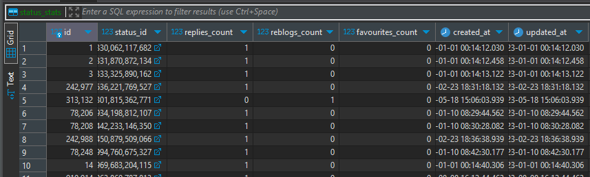

# TrendFetcher

## Table of Contents

- [About](#about)
- [Problem Statement](#problem-statement)
- [Solution](#solution)
- [How it works](#how-it-works)
- [Setup](#setup)
  - [Releases](#releases)
  - [Compiling from Source](#compiling-from-source)
  - [Configuration](#configuration)
    - [Mastodon Configuration](#mastodon-configuration)
  - [Running](#running)
  - [Additional Notes](#additional-notes)

## About

TrendFetcher is a service that allows you to view the "Explore" page of a Mastodon instance from your own instance, minimizing total server requests and allowing you to use your moderation tools on the statuses you see.

## Problem Statement

You have been enjoying your account on `big.masto.net`, and have decided to move to `small.masto.net` for certain features -- whether they be ergonomics, a specialized community, additional moderation tools, a fun theme skin, to reduce the server load on your favorite admin's instance, to generally support the cause of federation, or otherwise. \
After migrating your account, setting up your follows, and configuring a moderation blocklist, you finally have a familiar "Home" feed on `small.masto.net` that populates with the accounts you follow and the statuses they boost.

However, when you check your "Explore" feed, you discover it is empty. Despite knowing about statuses that meet the requirements for trendability (a certain number of likes or boosts, publically listed), the ActivityPub protocol doesn't communicate information about favourites or boosts, meaning that `small.masto.net` only knows about favourites or boosts on a `big.masto.net` status that were performed *on itself*, as opposed to *from any server* like you can see on `big.masto.net`.

You find yourself opening `big.masto.net` in another browser tab and viewing the "Explore" feed when you want to see what is trending. When you want to interact with a status, you copy the URL for it and paste it into `small.masto.net`'s "Search" bar, and then interact with it from there. You're not able to take advantage of any moderation features configured on `small.masto.net`, meaning you may frequently see posts from people you may want to have muted or blocked.

You might also become interested in participating in the community on `other.masto.net`, and you find that there's a lot of overlap between the "Explore" page of it and `big.masto.net`, each tallying up a different total number of likes and boosts. Additionally, every time you open the "Explore" page on `big.masto.net` you're making requests against its API as well as fetching its HTML/CSS and any media attachments.

## Solution

This service queries `big.masto.net` for its trending statuses (the "Explore" page) and makes note of their "favourite" and "boost" counts. \
Then it makes sure that `small.masto.net` has seen this status, which inserts it into the "Public" feed. \
Finally, it updates the PostgreSQL database on `small.masto.net` with the new favourite and boost counts, so that the "Explore" page on `small.masto.net` can be populated with the same statuses as `big.masto.net`.

Now you're able to browse the same "Explore" page from your own instance, with all of your moderation tools intact.

## How it works

Let's ask `big.masto.net` about its [trending status API](https://docs.joinmastodon.org/methods/trends/#statuses), which will return up to 40 of the highest scoring statuses in its `status_trends` table, and paginate through the responses until we receive an incomplete page, indicating we have all of the current trends.

Typically, an instance will return 1-5 pages, depending on how many statuses it considers trending. This uses 1 API call to fetch 40 statuses, with an average of 1 call, with additional calls only made as necessary.

```bash
http get https://big.masto.net/api/v1/trends
```

```json
[
  {
    "id": "108910940458127534",
    "created_at": "2024-09-20T08:44:26.366Z",
    "in_reply_to_id": null,
    "in_reply_to_account_id": null,
    "sensitive": false,
    // ...
    "content": "<p>Lorem Ipsum</p>",
    // ...
  },
  // ...
]
```

We'll place the results into a hashmap, keyed by the status's URI, allowing us to eliminate any duplicates. If we see any statuses with a base URL that we haven't seen before, we'll add it to a list of instances we want to fetch statuses from, and repeat the process until we don't discover any new servers.

Once we've assembled our collection of trending statuses, we'll launch a HTTP server using Rocket that has an endpoint capable of responding with ActivityPub objects for each status.

```rust
#[rocket::get("/users/<user>/statuses/<status_id>")]
```

For each status, we'll query the `statuses` table in `masto_production` PostgreSQL database on `small.masto.net` to see if the server has already seen the status.
```sql
SELECT id FROM statuses WHERE uri = $1
```


If it hasn't, we'll send a request to `small.masto.net`'s Search API endpoint to have it fetch the status from our temporary web server (instead of the original, saving the server from making an additional request to `big.masto.net`).

```bash
http get https://small.masto.net/api/v1/search?q=https://trendfetcher.small.masto.net/users/ExampleGuy/statuses/123456789012345678
```

Once we've confirmed the status is in the database, we insert or update the status's favourite and boost counts in the `status_stats` table.
```sql
INSERT INTO status_stats (status_id, reblogs_count, replies_count, favourites_count, created_at, updated_at)
```


## Setup

The recommended environment is localhost to your Mastodon instance. Additional configuration is required for remote access, noted below.

### Releases

Pre-compiled releases are not available yet. When they are, they will be available on the Releases page. For now, see [Compiling from Source](#compiling-from-source).

### Compiling from Source

You'll need Rust and Cargo installed. See [the Rust website](https://www.rust-lang.org/tools/install) for instructions.
```bash
curl --proto '=https' --tlsv1.2 -sSf https://sh.rustup.rs | sh
```

Linux binaries may need to install OpenSSL 1.1.1. Windows should compile without any additional dependencies.
```bash
wget http://nz2.archive.ubuntu.com/ubuntu/pool/main/o/openssl/libssl1.1_1.1.1f-1ubuntu2_amd64.deb
sudo dpkg -i libssl1.1_1.1.1f-1ubuntu2_amd64.deb
```

Clone the repository and compile the binary.
```bash
sudo su - mastodon
git clone https://github.com/Teqed/trend_fetcher.git
cd trend_fetcher
cargo build --release
```

### Configuration

Copy the example configuration files and edit them to include your domains.
```bash
cp config.toml.example config.toml
nano config.toml
```

```toml
[database]
    username = "mastodon"
    password = "mastodon"
    host = "localhost"
    port = 5432
    name = "mastodon_production"

[rocket]
    hostname = "trendfetcher.masto.net"

[servers]
    home = "small.masto.net"

    authenticated = [
        "big.masto.net",
    ]

    unauthenticated = [
        "other.masto.net",
    ]

```

The rocket hostname must be HTTPS endpoint that will redirect back to localhost:8000 when requested by the Mastodon instance. I personally use Caddy reverse proxy to accomplish this with automatic HTTPS certificates. See [the Caddy website](https://caddyserver.com/docs/install) for instructions.
```bash
nano /etc/caddy/Caddyfile
```
```conf
trendfetcher.masto.net {
    reverse_proxy localhost:8000
}
```

Place your instance in the 'home' section. Place any other instances in the 'unauthenticated' section.

If you have a profile on another instance and would like to use a token to authenticate with it, place it in the 'authenticated' section. If a `.toml` containing the token is not found in `/federation` (see example), you will be interactively prompted to create a token. Use the commandline to complete the authentication process.

Your PostgreSQL database may not allow password authentication by default. You may need to edit your `pg_hba.conf` file to allow password authentication for the `mastodon` user, or whichever user you'd like to use. (Developer note: I'd like to improve authentication here. Send an issue or PR for suggestions.)

```bash
sudo nano /etc/postgresql/12/main/pg_hba.conf
```    
```conf
# TYPE  DATABASE        USER            ADDRESS                 METHOD
local   all             mastodon                                md5
```

#### Mastodon Configuration

The table `status_trends` is responsible for tracking score and rank of statuses that are trending. The `allowed` column determines if a status is eligible to be included in the "Explore" page. By default, Mastodon applies filters to determine if a status fits the criteria for trending. By my findings, statuses side-loaded in this manner aren't considered eliglible, so we'll need to alter these filters to allow TrendFetcher to populate the table.

You can find the following statement in `app/models/trends/statuses.rb`:
```ruby
StatusTrend.upsert_all(to_insert.map { |(score, status)| { status_id: status.id, account_id: status.account_id, score: score, language: status.language, allowed: status.trendable? || false } }, unique_by: :status_id) if to_insert.any?
```

(Developer note: Do you know where the behavior for `status.trendable` is defined? Statuses seem to inherit this behavior from somewhere I've yet to find.)

Change the `allowed` value to always be `true`:
```diff
StatusTrend.upsert_all(to_insert.map { |(score, status)| { status_id: status.id, account_id: status.account_id, score: score, language: status.language,
-    allowed: status.trendable? || false
+    allowed: true
    } }, unique_by: :status_id) if to_insert.any?
```


Restart mastodon-web to apply the changes. (Developer note: Does mastodon-web have to be restarted for these changes to take effect, or are the changes hot-reloaded?)
```bash
sudo systemctl restart mastodon-web
```

### Running

The compiled binary will be located at `target/release/trend_fetcher`. You'll want to run the project from the root directory, so that it can find the `Rocket.toml` and `config.toml` files.
```bash
./target/release/trend_fetcher
```

A systemd unit file and timer can be used to automate the service:
```bash
sudo nano /etc/systemd/system/trend_fetcher.service
```
```systemd
# trend_fetcher.service
[Unit]
Description=TrendFetcher

[Service]
WorkingDirectory=/home/mastodon/trend_fetcher
ExecStart=/home/mastodon/trend_fetcher/target/release/trend_fetcher
User=mastodon
```
```bash
sudo nano /etc/systemd/system/trend_fetcher.timer
```
```systemd
# trend_fetcher.timer
[Unit]
Description=TrendFetcherHourly

[Timer]
OnCalendar=hourly
Persistent=true

[Install]
WantedBy=timers.target
```
```bash
sudo systemctl daemon-reload
sudo systemctl enable trend_fetcher.timer
sudo systemctl start trend_fetcher.timer
```

After making all the above changes and allowing the service to run, you should see the "Explore" page populate after a few minutes, once Mastodon has had a chance to calculate the scores and ranks of the statuses.

## Additional Notes

- Interaction counters in social media posts can be a [dark pattern.](https://en.wikipedia.org/wiki/Dark_pattern) Browse responsibly.
- Currently, replies are not fetched, but you may find projects like [FediFetcher](https://github.com/nanos/FediFetcher) interesting.
- The service will only fetch statuses from the "Explore" page. It will not fetch statuses from the "Local" or "Federated" pages. Relays are better suited for this purpose.
- Because access to the PostgreSQL database is required, which is typically only reachable on the local network, this service is best run on the same network as your Mastodon instance. If you'd like to run it remotely, you'll need to configure your PostgreSQL database to allow remote connections, which is outside the scope of this document.
- The Mastodon API applies some rate limits to the Search endpoint, even for authenticated users. These rate limits can be bypassed by requests *from the local network*, allowing the service to run faster. If you'd like to run the service remotely, you'll need to configure your Mastodon instance to allow remote requests to bypass the rate limits, which is outside the scope of this document.
- Mastodon will only fetch statuses from HTTPS endpoints, meaning a secure domain must be used, even if the service is only accessible on localhost. Bypassing this requirement is beyond the scope of this document.
- Because you need the above access *in addition to* a token to authenticate with the Mastodon API, this service is not suitable for use with a public instance. It is intended for use with a private instance, or a public instance that you have administrative access to. If you run a public instance and would like to use this service, contact me for suggestions.
- You can adjust the half-life of trend scores in `app/models/trends/statuses.rb`. The default is 1 hour and a decay base of 0.5, meaning a status will lose half of its score every hour. You can decrease the lifetime or increase the decay base to make the "Explore" page more dynamic, or increase the lifetime or decrease the decay base to make the "Explore" page more static. In 2023 the half-life was reduced from 2 hours to 1 hour in the official Mastodon release, and if using this tool I would recommend allowing scores to decay at an accelerated rate.